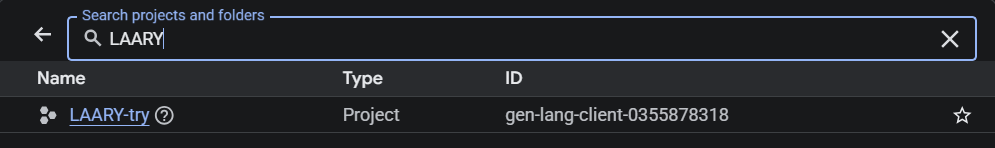
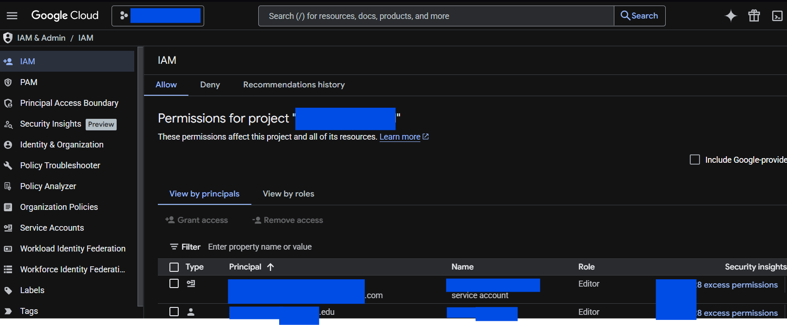
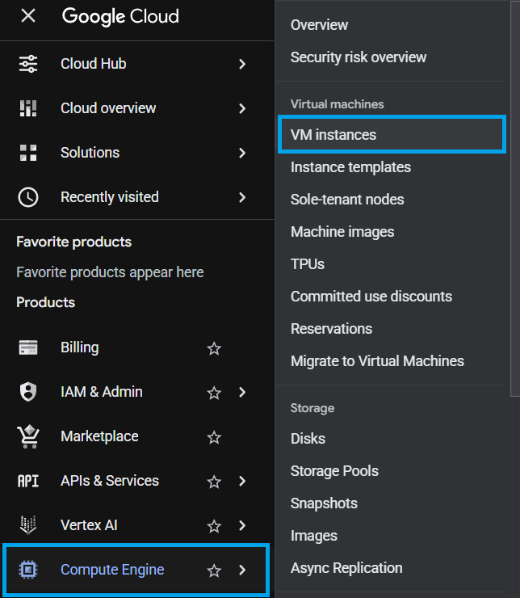
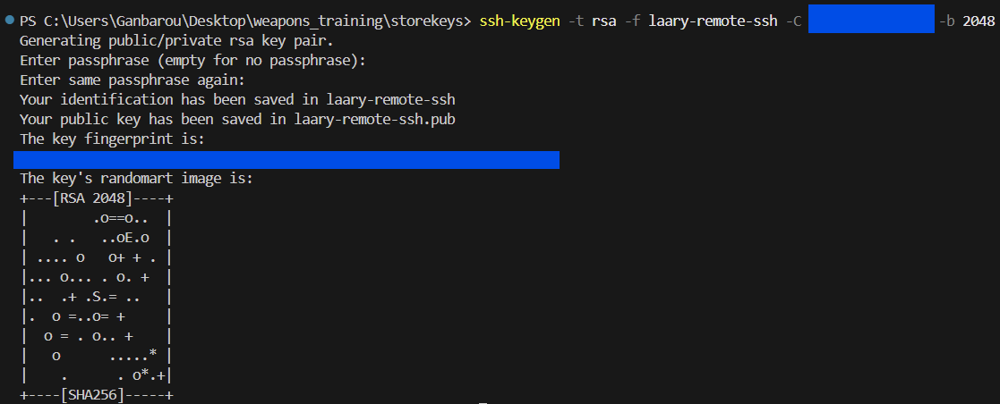
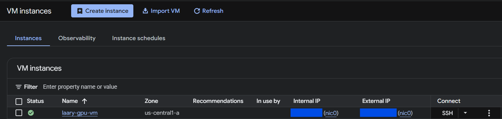
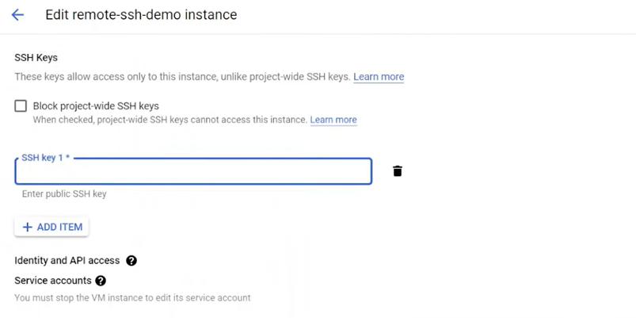
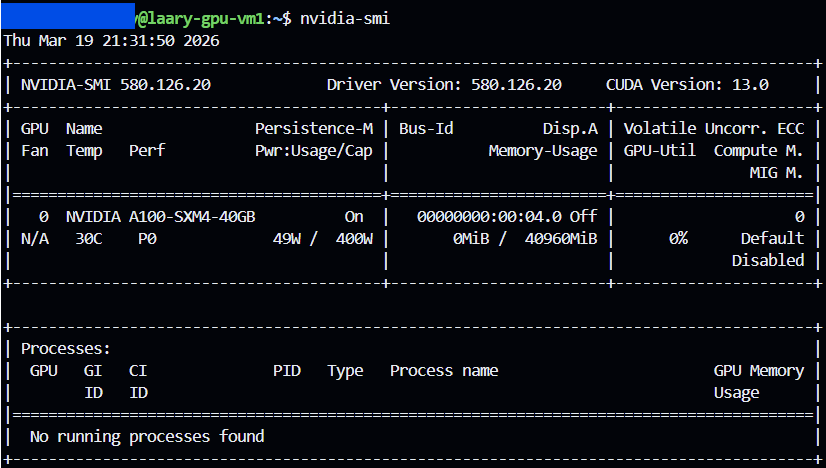

# GCloud VM with VSCode
This guide walks you through setting up a virtual machine on Google Cloud and connecting it to Visual Studio Code using Remote SSH. It covers everything from selecting a project and configuring a VM instance to generating SSH keys, connecting securely, and transferring files.

The goal is to provide a simple, end-to-end workflow so you can quickly spin up a cloud VM and start developing or running workloads (like GPU training) directly from VSCode using this repo (`https://github.com/Pixels2bytes/VM_Setup.git`).

## Getting Started
- [Check Credentials](#check-credentials)
- [Setup VM Instance in GCloud](#setup-vm-instance-in-gcloud)
- [Setup SSH Configuration File](#setup-ssh-configuration-file)
- [Link VSCode to VM](#link-vscode-to-vm)
- [Run VM](#run-vm)
- [GPU Setup](#gpu-setup)
- [[BONUS] Transfer Files From Local Computer to VM](#bonus-transfer-files-from-local-computer-to-vm)
- [Helpful Links](#helpful-links)

Go to Google Cloud > Select Project Picker (`Left-hand corner next to the GCloud Title`) > Find Project:

```
https://console.cloud.google.com/
```
*NOTE* If you’re part of an organization and don’t see your project listed, or you don’t appear linked to any organization, you’ll need to contact your Google Cloud Administrator. Permissions to access projects are managed by the organization. Tthere’s nothing you can do on your own to gain access.

## Check Credentials
- Get your username and ensure your role is Editor



## Setup VM Instance in GCloud
- Go to Compute Engine > VM Instances



- Select `Create Instance` from VM Instances Dashboard

You will be taken to Machine Configuration. Name your virtual machine `project-name-gpu-vm`.Ten select the machine type fit for your project. If you are unsure, use the Gemini AI Agent to help select the best fit for you. 

Once completed, ensure the VM status is `ON` then copy the `External.IP.Address`. If the VM is not on, navigate to the hamburger (`...`) symbol and select `Run/Resume`. The External IP should show.

## Setup SSH Configuration File
- Open VSCode and clone VM_Setup: git clone 
- Download Extension - Remote SSH
- Command Palette > Remote-SSH: Open SSH Configuration File...

```
# VM Template [Reason - $Price/hr]
Host project-name-remote-ssh
HostName External.IP.Address
User your_username_from_GC_IAM
IdentityFile C:\Users\Username\Desktop\VM_SETUP\storekeys\project-name-remote-ssh
```

- Generate SSH keygen: In VSCode go to Terminal > New Terminal and type:

```ssh-keygen -t rsa -f project-name-remote-ssh -C your_username_from_GC_IAM -b 2048```

*PRESS* Enter, Enter



- Paste the private file `project-name-remote-ssh` location in SSH Configuration IdentityFile
- Open the public file `project-name-remote-ssh.pub` and copy the key + username

## Link VSCode to VM
Go to the VM Instances Dashboard > Select the VM



- Go to Edit > SSH Keys section
- Press `Add Item` and paste the key + username in the SSH Public Key field then save



## Run VM
- Command Palette > Remote-SSH: Connect to Host... > Select Host Project `project-name-remote-ssh`
- Select Linux
- Open folder as your username/home

## GPU Setup
By default, Google Cloud GPU VMs do **not** come with NVIDIA drivers installed. This means that even if you selected a GPU, frameworks like PyTorch will not detect it until the drivers are installed.

- Inside the VM terminal set to @username/project-gpu-vm, run this to download the gpu installer script:
```
curl -L https://storage.googleapis.com/compute-gpu-installation-us/installer/latest/cuda_installer.pyz --output cuda_installer.pyz
```

- Install NVIDIA driver (Required for Debian-based systems):
```
sudo python3 cuda_installer.pyz install_driver --installation-mode=binary
```

- Install CUDA Toolkit
```
sudo python3 cuda_installer.pyz install_cuda
```

- Reboot
```
sudo reboot
```

- Verify if it worked
```
nvidia-smi
```


- Verify in Python
```
python -c "import torch; print(torch.cuda.is_available()); print(torch.cuda.device_count()); print(torch.cuda.get_device_name(0))"
```
Terminal Output:
```
True
1
GPU Name...
```

*NOTE* If you get `"bash: python: command not found"`, install Python and Pytorch globablly then reverify in Python:
```
sudo apt update
sudo apt install python3-pip -y
python3 -m pip install torch torchvision torchaudio --index-url https://download.pytorch.org/whl/cu118
```

## [BONUS] Transfer Files From Local Computer to VM
Outside of VSCode, open Powershell and type:

```
scp -i "C:/Users/Username/Project/Location/Of/StoreKeys/PRIVATE-SSH-FILE-Here-ssh" -r "C:/Users/Username/Location/Of/File/Folder/To/Copy/From/Here" username@ExternalIP:/home/username/Folder/To/Copy/To/Here
```

## Helpful Links
- *YOUTUBE VIDEO:* SSH into Remote VM with VS Code | Tunneling into any cloud | GCP Demo:
https://www.youtube.com/watch?v=0Bjx3Ra8PRM
- *ARTICLE:* Getting Started - First-Time Git Setup: https://git-scm.com/book/en/v2/Getting-Started-First-Time-Git-Setup
- *ARTICLE:* Boot Disk Storage Increase: https://docs.cloud.google.com/compute/docs/disks/resize-persistent-disk
- *ARTICLE:* Install GPU Drivers: https://docs.cloud.google.com/compute/docs/gpus/install-drivers-gpu
- *ARTICLE:* GPU Machine Types: https://docs.cloud.google.com/compute/docs/gpus
- *ARTICLE:* Kernal Crashes: https://github.com/microsoft/vscode-jupyter/wiki/Kernel-crashes
